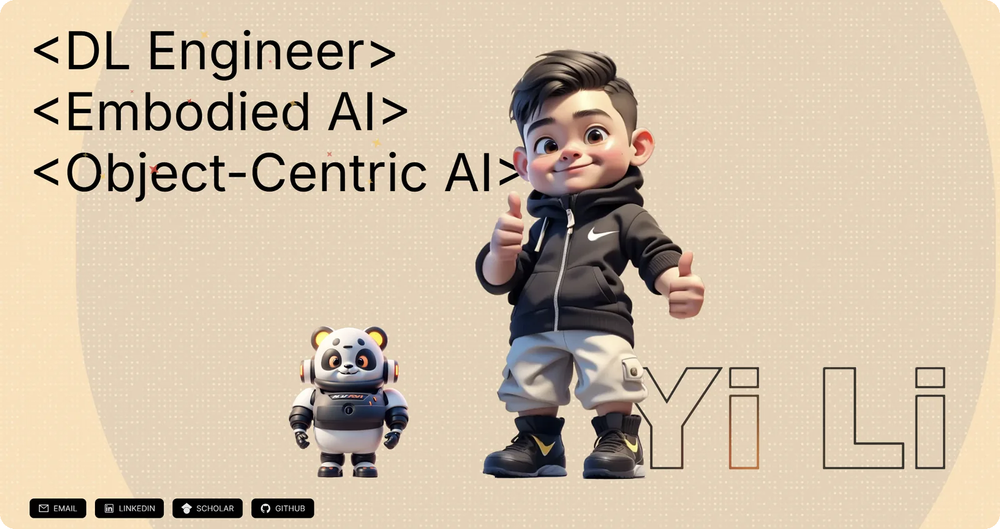

# yili-dev.com

[](https://yili-dev.com)

Hi — I'm Yi Li. This repo is the source of my personal site, **https://yili-dev.com**.
If you landed here from the site, the site itself is the better read.

I did my M.Sc. in Computer Science at TU Darmstadt, on object-centric visual representations
for robotic manipulation (first-author paper at the
[RSS 2026 workshop *From Perception to Action*](https://arxiv.org/abs/2607.09825)), and I've
spent four years doing applied AI in industry alongside and before that — mostly computer
vision and optimisation on real production data at Merck.

The site collects the work in one place: publications, seventeen research and industry
projects with the actual numbers attached, the timeline, and what I'm looking for next
(PhD positions, industrial research, vision & medical AI).

**Reach me:** [email](mailto:liyi.freddy@gmail.com) ·
[LinkedIn](https://www.linkedin.com/in/yi-li-dev/) ·
[Google Scholar](https://scholar.google.com/citations?user=Ffr3i_YAAAAJ)

---

Built with Next.js 14 and TypeScript, Tailwind for styling, `motion/react` for the animation.
The knowledge graph and the skill charts are hand-written SVG rather than a charting library —
I wanted them to behave a particular way, and it kept the bundle honest. Content is static and
typed; nothing is fetched at runtime.

```bash
npm install && npm run dev
```
